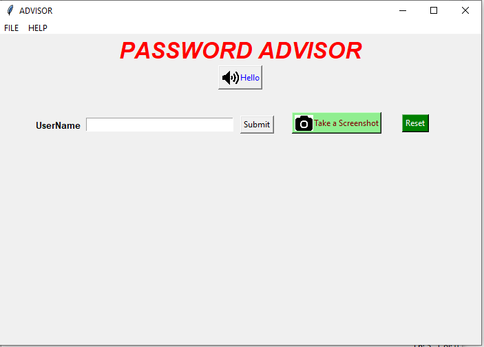
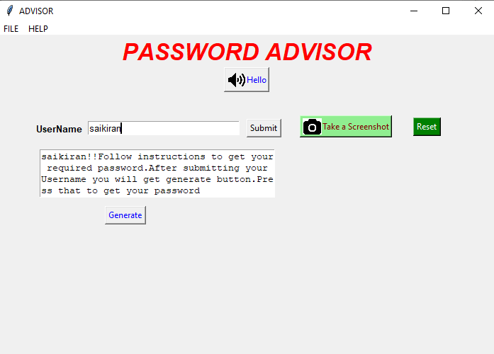
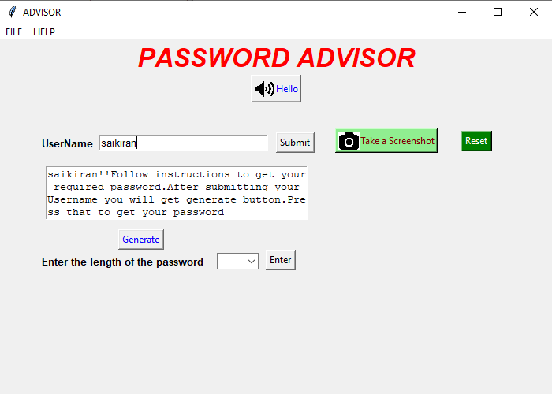
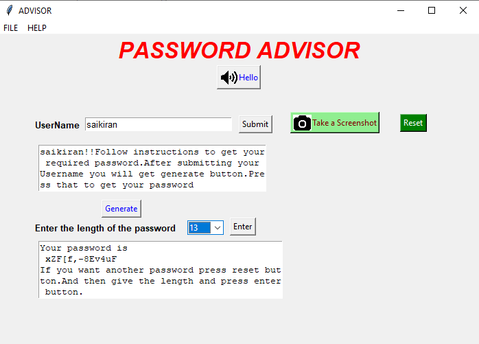

# Password-Generator-using-Tkinter
This application can generate random password, with the combination of letters, numerics, and special characters based on required length.And it also allows to take screenshot.
# Software Requirements
* [Python](https://www.python.org/downloads/)
* Any text editor of your choice
* pip package
# Programming Language
Python
# Modules Needed
* import tkinter
* import random
* import pyautogui
* import pyttsx3 
Random module: It selects elements randomly from a list. 
pyautogui module:It can be used to take screenshots.To install pyautogui type the below command in the terminal. 
**pip install pyautogui** 
pyttsx3 module:pyttsx is a cross-platform text to speech library which is platform independent.However, pyttsx supports only Python 2.x. Hence, we will see pyttsx3 which is modified to work on both Python 2.x and Python 3.x with the same code.To install pyttsx3 type the command in the terminal. **pip install pyttsx3** 
# Note
The output has two images.One image is on hello button and another image on take a screenshot button.Before running this code on your system.Make sure to change the path of the images in the code.If you don't do hello button and take a screenshot buttons won't display and it gives an error.
# Output

